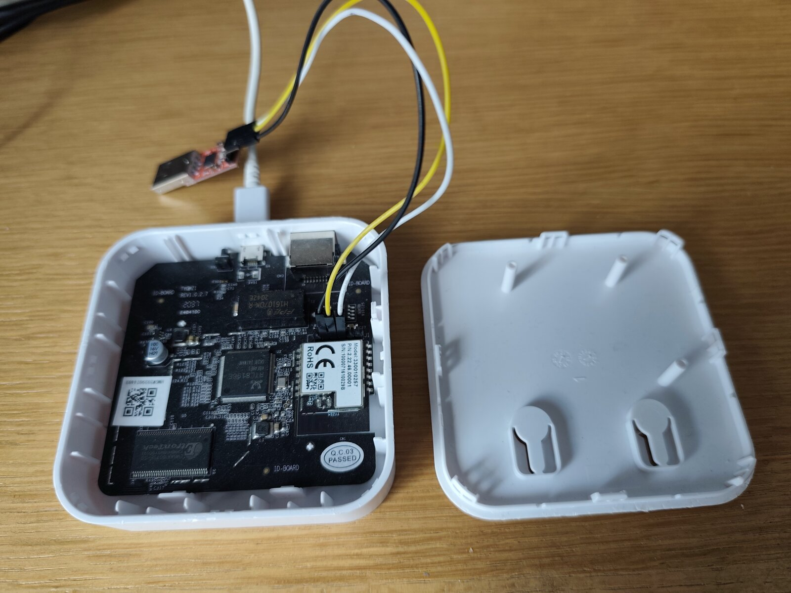

# Lidl / Silvercrest Gateway Hardware

This page documents the Lidl Silvercrest / Tuya reference board: case opening,
the J1 serial/SWD header, PCB identification, and the main components.

If you are preparing a first installation, use this page to identify the
connector, then return to the
[step-by-step installation guide](../docs/getting-started.md). Sengled owners
must use the [Sengled Smart Hub G4 hardware page](./sengled-e39-g8c/README.md)
because its PCB and debug connector are different.

## Safety and tools

- Disconnect the normal power supply before opening the case or moving wires.
- Use a **3.3 V TTL** USB-to-UART adapter, not RS-232 and not 5 V logic.
- Do not power the gateway from the UART adapter.
- J1 is not populated at the factory. A 2.54 mm header can be soldered in, or
  suitable test hooks can be used if they make reliable contact.
- Avoid loose probes during a flash; an intermittent ground or serial contact
  can turn a recoverable operation into a difficult recovery.

## Open the case

The case has no screws and no fasteners hidden under the label. It is a
snap-fit shell held by **eight plastic clips** around the edges, and the seam
is additionally **bonded with adhesive** along the perimeter. Because of that
glue, the halves will not separate by clip pressure alone, and forcing a single
corner cracks the plastic or snaps a clip. The reliable, non-destructive
approach is to soften the adhesive first and release the clips gradually all the
way around.

<p align="center">
  
</p>

The PCB stays in the shell that carries the Ethernet and micro-USB cutouts (left
above). The plain cover with the two keyhole wall-mounts (right above) is the
half that lifts off.

### Tools

- One or two thin, **non-conductive** opening picks — guitar picks, a plastic
  spudger, or purpose-made phone-opening picks. Avoid metal blades: they mar the
  shell and can slip onto the PCB.
- Isopropyl alcohol (IPA, 90 % or higher) to weaken the seam adhesive.
- Optional: a hair dryer or other gentle, even heat source (roughly hand-hot).
  Do **not** use a heat gun at full power.

### Procedure

1. **Disconnect power.** Never pry a powered board.
2. Locate the seam between the two shell halves. Start on an edge away from the
   Ethernet and power connectors — the opposite edge works well — and pull the
   halves straight apart rather than twisting them.
3. Soften the seam: warm it evenly for a minute or two, or run a thin bead of
   IPA along it and let it wick in for a moment. Heat also makes the plastic
   slightly more forgiving. Do not overheat — excess heat deforms the case and
   can damage components.
4. Insert a pick into the seam at the starting point and slide it a short way
   until a clip releases. Leave that pick in place to hold the gap open.
5. With a second pick, walk around the perimeter releasing the clips one at a
   time, re-applying IPA or warmth as needed. Move steadily around all four
   sides instead of levering hard at one spot.
6. When the clips are free and the adhesive has let go, lift the halves apart
   evenly. Some adhesive residue on the mating edges is normal and does not
   affect reassembly.
7. Remove the PCB only if you need to reach J1, and only with power
   disconnected. Handle it by the edges and keep the pick tips clear of the
   antenna and the TYZS4 module.

### Reassembly

The clips re-latch on their own, and the residual adhesive is usually enough to
hold the seam closed — press around the perimeter until every clip clicks. A
thin line of fresh adhesive along the seam restores the original sealed feel if
you want it, but leave the case easy to reopen (and J1 accessible) if you expect
to reflash later.

## PCB overview and J1 location

The **cyan rectangle** in this photo marks J1, the vertical six-pin connector
used for the RTL8196E serial console and EFR32 SWD signals.

<p align="center">
  
</p>

The other highlighted components are:

- **red** — RTL8196E main processor;
- **green** — 16 MiB SPI NOR flash;
- **purple** — 32 MiB SDRAM;
- **yellow** — TYZS4 module containing the EFR32 radio.

## J1 pinout

Pin 1 is the bottom pin in the documented board orientation shown above.

| Pin | Signal | First-install use |
| --- | --- | --- |
| 1 | 3.3 V VCC | Leave disconnected |
| 2 | Ground | UART adapter GND |
| 3 | RTL8196E serial TX | UART adapter RX |
| 4 | RTL8196E serial RX | UART adapter TX |
| 5 | EFR32 SWDIO | Do not connect for a normal install |
| 6 | EFR32 SWCLK | Do not connect for a normal install |

The three-wire serial connection is therefore:

```text
Gateway J1 pin 2 GND  --------  adapter GND
Gateway J1 pin 3 TX   --------  adapter RX
Gateway J1 pin 4 RX   --------  adapter TX
Gateway normal power supply    (adapter VCC not connected)
```

TX and RX are intentionally crossed. The UART adapter is a signal interface,
not the gateway power source.

To see how to solder the male pin header into J1 and wire the adapter with
Dupont cables, watch the [step-by-step animation](https://jnilo1.github.io/rtl8196e-gateway/0-Hardware/media/j1-serial-hookup.html).

## RTL8196E serial console settings

| Setting | Value |
| --- | --- |
| Logic level | 3.3 V TTL |
| Speed | 38400 baud |
| Data format | 8 data bits, no parity, 1 stop bit (8N1) |
| Flow control | None |

Example with picocom:

```bash
picocom --baud 38400 --flow n /dev/ttyUSB0
```

Power on the gateway and press `Esc` repeatedly to stop at the `<RealTek>`
bootloader prompt. Serial text that is unreadable usually means the baud is
wrong; no text usually means the device, ground, TX/RX, or contact is wrong.
See [Troubleshooting](../docs/troubleshooting.md#no-readable-serial-output).

## Main components

### RTL8196E main processor (U2)

- Realtek RTL8196E with a 32-bit Lexra RLX4181 core
- 400 MHz CPU
- integrated Ethernet switch
- SPI controller for external NOR flash
- two 16550A-compatible UARTs at MMIO `0x18002000` and `0x18002100`

The RTL8196E runs the custom bootloader and Linux. UART0 is the J1 console;
UART1 connects to the EFR32 radio.

Datasheet: [RTL8196E-CG](./datasheet/RTL8196E-CG-datasheet.PDF).

### SPI NOR flash (U3)

- GigaDevice GD25Q127C family
- 16 MiB capacity
- 64 KiB erase blocks
- stores bootloader, Linux kernel, read-only rootfs, and persistent userdata

Datasheet: [GD25Q127C](./datasheet/GD25Q127C_datasheet.pdf).

### SDRAM (U5)

- 32 MiB SDRAM
- ESMT M13S2561616A or equivalent

### TYZS4 radio module (CN1)

- Tuya TYZS4 module
- Silicon Labs EFR32MG1B232F256GM48
- ARM Cortex-M4 with IEEE 802.15.4 radio
- connected to RTL8196E UART1
- can run NCP, RCP, OT-RCP, or standalone Zigbee router firmware

Datasheets: [TYZS4](./datasheet/Tuya%20TYZS4%20datasheet.pdf) and
[EFR32MG1](./datasheet/EFR32MG1-datasheet.pdf).

## Two debug functions, two use cases

J1 combines unrelated interfaces:

- **Pins 2–4, UART0** — RTL8196E console. This is what a normal first Linux
  installation uses.
- **Pins 1, 2, 5, 6, SWD** — low-level EFR32 programming. This is required only
  for a virgin/corrupted EFR32 Stage-1 bootloader or specialist recovery.

Do not confuse the first-install UART connection with the internal UART1 link
between the two chips. The user-facing serial console runs at 38400; EFR32
applications normally run at 115200 or faster on a different UART.

## Next steps

- [First installation](../docs/getting-started.md)
- [Backup and restore](../3-Main-SoC-Realtek-RTL8196E/30-Backup-Restore/README.md)
- [Choose a radio mode](../docs/radio-options.md)
- [Sengled Smart Hub G4 hardware](./sengled-e39-g8c/README.md)
